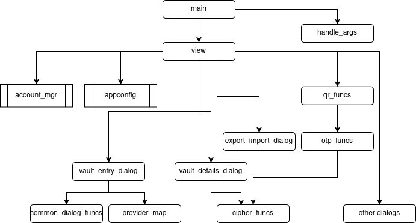

## Design Overview

This application is essentially a CRUD application that maintains a very simple flat-file database.
The main features of the application are to create new accounts,
display a list of accounts,
generate one-time passcodes from an account,
and update and delete accounts.

The design uses a Model-View architecture.

This diagram shows a simplified module hierarchy chart.

The `view` module is the GUI main window and is the focus of user interaction.  
The `account_mgr` module is the data model, a list of accounts that are stored in the vault.

There are a number of subsidiary dialogs for special operations.
There are several utility modules that perform special functions on the data model.

`appconfig` handles the user preference settings.  
`qr_funcs` processes QR codes.  
`otp_funcs` generates one-time passcodes.  
`cipher_funcs` are encrypt and decrypt functions used to manage the secret keys.

`vault_entry_dialog` allows the user to manual enter a new account.  
`vault_details_dialog` provides for updating and deleting an account.

`account_mgr` actually has two dataclasses.
`Account` represents the information stored in the vault including an encrypted secret key.
But there are times when the application wants to process the data prior to storing it in the vault,
thus a second dataclass, `OtpRecord`, is just the three fields for provider, user, and secret (in plaintext). 

A related subtlety is the backup and restore functions of the account manager are for saving and loading
accounts from the vault (with encrypted secret keys), but export and import are for external file i/o
and thus deal with plaintext secret keys.

## Design Rationale

I originally had a Controller to mediate between View and Model but decided it was redundant. The reason to have it
would be to move logic out of View, but it turns out that most of the logic is done in other dialogs, so
the Controller wasn't needed.

I decided to make both AppConfig (preferences) and AccountManager as singletons.  The advantage is
we don't end up with multiple instances floating around and maybe getting out of sync. E.g., the
reorder dialog accounts not being in sync with the main window.

I added an OtpRecord to AccountManager because I was getting type errors due to the Account class
sometimes containing encrypted secret and sometimes plaintext.  Now it's clear that OtpRecord
has plain-text and now it's easy to tell what type you should be expecting.

Initially the GUI had an Add Account dialog as found in most CRUD applications,
but after using the program for a while I realized that in almost every situation
the user is going to simply scan a QR code to create an account,
so I removed much of the functionality of that dialog and moved it
into the File menu.
Instead there's a single button in the main window "Scan QR code" that scans the QR code
and creates a new vault entry and displays it at the top of the list, so no dialog is needed.
I added a "QR code found!" popup to serve as feedback and now the workflow is much simpler.

The first implementation had Copy and Edit icons similar to some other app I reviewed,
but at the suggestion of some pilot testers I removed the icons and enabled clicking on
the displayed values themselves.  So click on the 6-digit code to copy it to the clipboard,
and click on the provider name to open the edit dialog.

I considered having a sort button on the toolbar but eventually decided it just cluttered the
interface and wasn't used that often.
So now the sort functions are listed in the Tools menu.

I decided to have Import auto-detect whether the file is URI or JSON.  Eliminates the user having to
select one or the other when they may have forgotten or not know.

