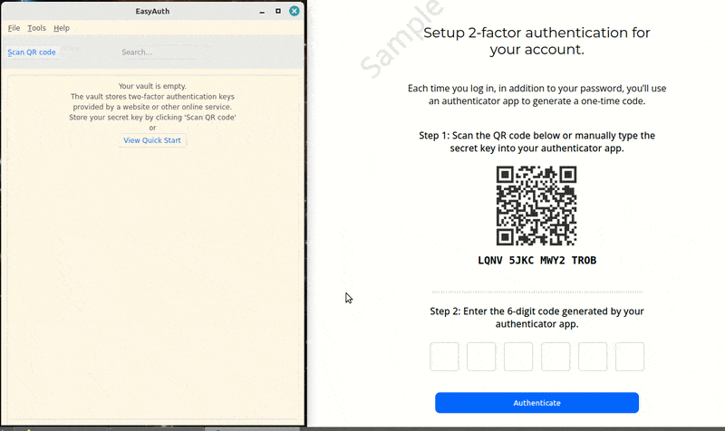
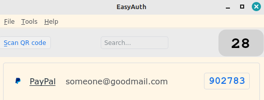
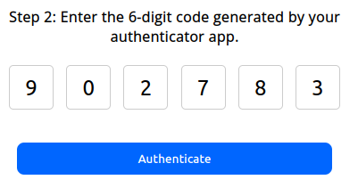
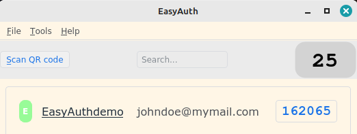

The easiest (and fastest) way to 2FA verification.

  
<h3 style="text-align: center;"> 
<a href="https://github.com/jdalbey/EasyAuth/releases/latest">Download for Windows and Linux</a>  
</h3>

### What is it?  
EasyAuth is a desktop application that helps you authenticate with a website or online service that uses two-factor authentication. EasyAuth stores the secret keys that websites provide when you enroll in two-factor authentication and then generates the one-time passcodes that you use to verify your identity.

### What's unique about it?  
It's quicker and less hassle than other 2FA methods or applications.
Since it's a desktop application it doesn't require a smartphone or a cell connection.
It doesn't require manually typing verification codes.
During setup of an account it scans QR codes for you. 

### How do I use it?  
1. When setting up 2FA a QR code will be displayed in your browser. Launch EasyAuth and click the  button.
2. The secret key is stored in the vault.
    
3. Click on the passcode button to copy it to the clipboard.
4. Paste the code into the verification form.
   

### Features
 - Stores your secret keys encrypted in a vault on your local machine (doesn't rely on third-party cloud services).
 - Automatically finds QR codes displayed on the screen.  No need to scan QR codes with your phone.
 - Generates Time-based One-time Passwords from your secret keys.
 - Familiar easy-to-navigate desktop GUI.
 - Accounts are displayed in a scrollable list with a search feature.
 - The list can be sorted alphabetically, by usage frequency, by most recently used, or manually reordered to achieve a custom ordering. 
 - Export and Import vault to plain-text JSON file or otpauth URI format.
 - Vault entries can be displayed as QR codes for migration to other applications.
 - GUI includes light and dark themes.
 - Preferences dialog has useful customization settings.

### Learn More
 [Quick Start](https://github.com/jdalbey/EasyAuth/blob/master/docs/Quick%20Start%20Guide.md)  
 [User Manual](https://github.com/jdalbey/EasyAuth/wiki/User-Manual#easyauth-user-manual)  
 [Video tutorial](https://www.youtube.com/watch?v=-LsL8Jgswqo) (11 minutes)  

### Screenshot gallery
[View Screenshots](screenshot_gallery.md)  

### Demo video (2 minutes)
<iframe width="700" height="475" src="https://www.youtube.com/embed/EwcvA4PUlV0" title="EasyAuth v0.3.0 Demo - setup two-factor authentication" frameborder="0" allow="accelerometer; autoplay; clipboard-write; encrypted-media; gyroscope; picture-in-picture; web-share" referrerpolicy="strict-origin-when-cross-origin" allowfullscreen></iframe>  

### Try it out

Practice storing a new secret key using this sample QR code.  

  

1. Launch EasyAuth.
2. Make sure the QR code above is visible on the screen. Click 'Scan QR code".
3. The QR code is read and a new vault entry created using the secret key, provider name, and user. 
4. Observe the new entry in the main window. 

  

[Sample 2FA Setup Page](Setup2FA_1_QRcode.html)

